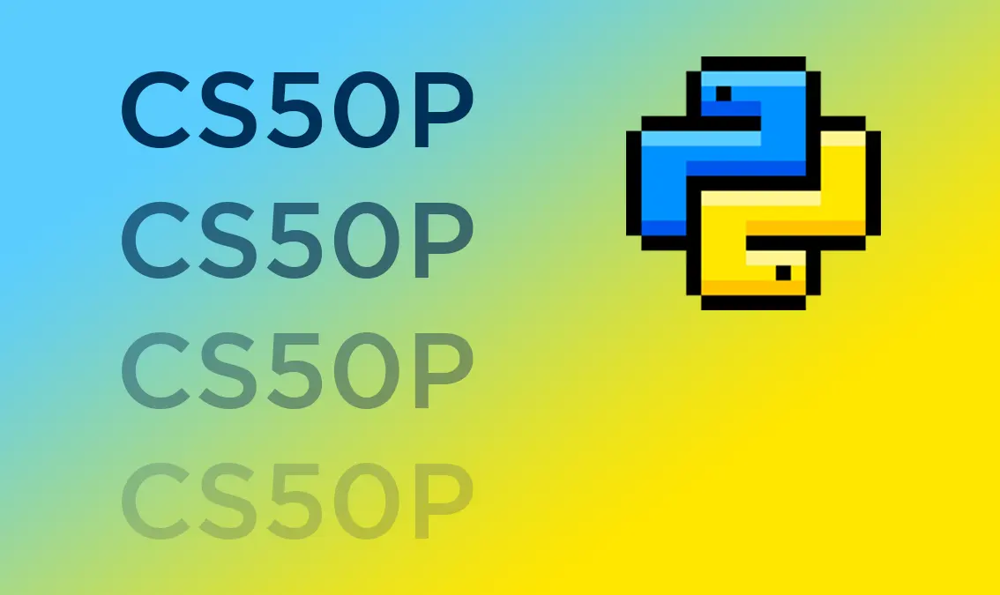

# CS50's Introduction to Programming with Python Solutions (2025 Version)

🐍 This repository contains my solutions to the problem sets from Harvard University's CS50's Introduction to Programming with Python course.

## About the Course
CS50 Python is an excellent introduction to programming with Python offered by Harvard University. The course covers fundamental concepts including:
  • Data types and control structures
  • Functions and object-oriented programming
  • File handling and libraries
  And many other essential programming concepts

## My final project
You can view my final project at the following link:
<https://github.com/Alireza-njt/Connect-Four>

## **License & Academic Integrity**  
This repository is licensed under the **MIT License**. However, **these solutions are intended for learning purposes only**.  

🚨 **Important:**  
- **Do not submit these solutions as your own work** (violates academic honesty).  
- **Try solving problems yourself first**—learning comes from struggle!  
- **Use this as a reference** if you're stuck, but write your own code.  
